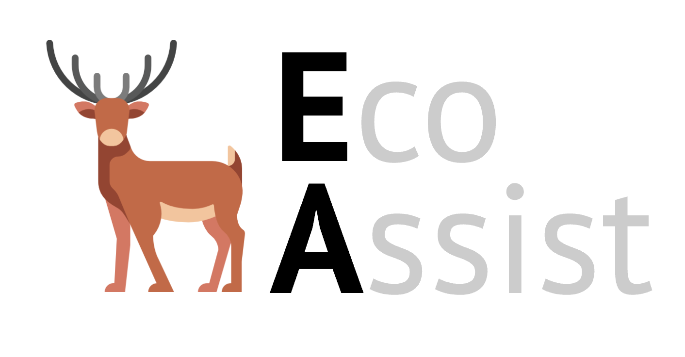

<html>
  <head>
    <meta name="google-site-verification" content="Fa9AuK39hAqDGEC7hr32UtxcVsVJ-qLHsZ34C2brsd0" />
  </head>
  

    
  

  
  
  
  
  
  
</html>

  
  
  
  

### EcoAssist is an application designed to make life easier for people who want to work with object detection models. See its [GitHub page](https://github.com/PetervanLunteren/EcoAssist/blob/main/README.md) for more information.
