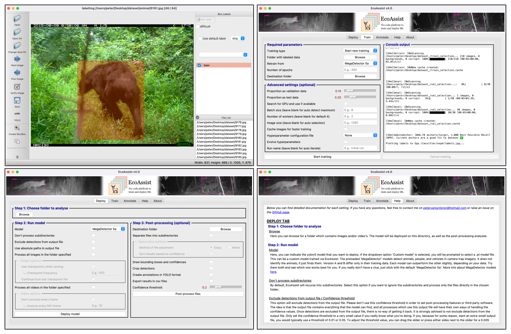

# Summary
`EcoAssist` is a tkinter based graphical user interface (GUI) which is designed to enable object detection for novices. The package allows the user to install dependencies with a single click, annotate images, train and deploy custom models, and post-process imagery without having to write code (\autoref{fig:1}). Annotation is done via the open-source package `labelImg` [@heartexlabs] and post-processing features include folder separation, detection visualization, cropping, label creation, and exporting results to CSV files. It will automatically run on NVIDIA or Apple Silicon GPU and is available for Microsoft Windows, Apple macOS, and Linux. The main target audience is ecologists working with motion triggered camera traps, although it is not limited to detect animals as object detection models are generic. The package is developed to be used in conjunction with Timelapse [@greenberg] (a widely used image analyzer for camera traps) and MegaDetector [@beery] (a trained object detection model to localize animals in camera trap imagery). More features are planned and will be added in the future.

# Statement of need
Given the unprecedented global decline of animal diversity [@ceballos], conservationists urgently need tools for accurate and fast assessment of wildlife diversity [@tuia]. A commonly used method for this is deploying ecological motion triggered camera traps [@schneider]. However, the analysis of such data is often expensive, labor-intensive, and time-consuming [@beery]. Fortunately, optimizing this workflow with machine learning techniques has proven to be an effective method [@gomez; @schneider; @norouzzadeh]. 

One such example is the MegaDetector model [@beery]. This model is able to drastically reduce the workload by facilitating the removal of empty camera trap images. Although the model does not identify the species, it offers a simplification of the annotation process for users wanting to train their own project-specific species classifier by providing bounding box coordinates. Still, the only way to interact with the model is exclusively through Python code and command-line interfaces. Users without a programming background might find it difficult to implement this software. These users, thus, might miss out on valuable and open-source techniques without GUIs such as `EcoAssist` - which are designed to overcome this limitation.

Besides `EcoAssist` there are three other GUIs able to deploy the MegaDetector model (i.e., @evans; @gyurov; @mcwilliam). However, none of these packages offer features to annotate and train custom models, nor do they accept the deployment of custom models. Furthermore, @gyurov and @mcwilliam do not offer functionality on systems other than Microsoft Windows. 

# Generic platform
Although `EcoAssist` was originally designed for ecologists working with camera trap imagery, it evolved to be a more generic platform to be used by any researcher wanting to work with object detection models. All features are available with any kind of object, which makes it an interesting tool for many academic disciplines. The package has proved its ease of use and ability to efficiently analyze large datasets and is currently used by dozens of research institutions worldwide. Its user-friendly design, simplicity, and support will likely extract further scientific interest.

# References
